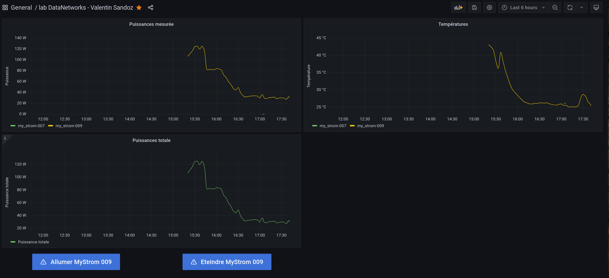

# lab_DataNetworks
Laboratoire de Systèmes d'Information (SIn) de 3ème année en énergie et techniques environnementales

## Environement virtuel
En Python, on travaille souvent dans des environnements virtuels, 
ils permettent de travailler avec les mêmes versions des paquets, quels que soit la machine utilisée
et les versions installée "de base"

Dans ce projet, nous développons sur notre laptop, puis excécutons les programmes sur le raspberry-pi. L'intérêt d'un
environnement virtuel est totalement justifié.

Pour que le programme fonctionne correctement, il est nécessaire d'installer les librairies de `requirements.txt`

### Installation de virtualenv 
```bash
pip3 install virtualenv
```

### Création de l'environnement virtuel
Exécuter les commandes dans le dossier du répertoire

```bash
virtualenv -p python3 venv # création d'un environnement virtuel avec python3
source venv/bin/activate # activation de l'environnement virtuel
pip install -r requirements.txt # installation des paquets requis
```

### Désactiver l'environnement virtuel
```bash
deactivate 
```

### Activer l'environnement virtuel
```bash
source venv/bin/activate
```

## Fichier de configuration

Il est nécessaire de remplir le fichier de configuration [crendentials.toml](credentials.toml) avec les données du broker mqtt, de la mystrom switch et du server influxdb, selon ce format : 
```toml
[MQTT]
broker =
username =
password =

[InfluxDB]
token =
org =
bucket =

[MyStromSwitch]
name =
macAdress = 
```

## Fonctionnement des scripts en arrière plan
Afin que les scripts fonctionnent en arrière-plan sur la raspberry-pi, nous allons créer un *service* avec systemd.

### Plug to MQTT

#### 1. Créer les fichiers de service pour les deux programmes

```bash
sudo nano /etc/systemd/system/plug_2_mqtt.service
```
#### 2. Coller la configuration en veillant à ce que le chemin du répertoire (ici `/home/pi/lab_DataNetworks`) soit le bon
```ini
[Unit]
Description=Plug to MQTT
After=multi-user.target

[Service]
Type=simple
Restart=always
ExecStart=/home/pi/lab_DataNetworks/venv/bin/python /home/pi/lab_DataNetworks/plug_2_mqtt.py

[Install]
WantedBy=multi-user.target
```
#### 3. Activer le service
```bash
sudo systemctl daemon-reload # Recharge les fichiers de configuration
sudo systemctl enable plug_2_mqtt.service # Activer le service
sudo systemctl start plug_2_mqtt.service  # Démarrer le service (pour la première fois, ensuite il sera automatiquement activé)
```

Il est possible de vérifier le status du service en entrant `sudo systemtl status plug_2_mqtt.service`

### MQTT to influx
#### 1. Créer les fichiers de service pour les deux programmes

```bash
sudo nano /etc/systemd/system/mqtt_2_influx.service
```
#### 2. Coller la configuration en veillant à ce que le chemin du répertoire (ici `/home/pi/lab_DataNetworks`) soit le bon
```ini
[Unit]
Description=MQTT to influxdb
After=multi-user.target

[Service]
Type=simple
Restart=always
ExecStart=/home/pi/lab_DataNetworks/venv/bin/python /home/pi/lab_DataNetworks/mqtt_2_influx.py

[Install]
WantedBy=multi-user.target
```
#### 3. Activer le service
```bash
sudo systemctl daemon-reload # Recharge les fichiers de configuration
sudo systemctl enable mqtt_2_influx.service # Activer le service
sudo systemctl start mqtt_2_influx.service  # Démarrer le service (pour la première fois, ensuite il sera automatiquement activé)
```

Il est possible de vérifier le status du service en entrant `sudo systemtl status mqtt_2_influx.service`

## Serveur Flask
Le serveur Flask permet de lier le bouton grafana au reste du système en transformant la reqête REST en requête MQTT. 

### Serveur de développement
Attention, le serveur utilisé ici est un serveur de développement, il n'est pas sécurisé et ne doit pas être allumé par un service 24h/24. Il serait nécessaire d'utiliser un autre service pour lancer un serveur WSGI comme Waitress. Le cas d'un serveur en mode production n'a pas été abordé dans ce laboratoire. La documentation Flask donne les informations pour le déploiement du serveur sur cette [page](https://flask.palletsprojects.com/en/2.2.x/tutorial/deploy/).

### Génération du certificat

Cette commande permet de générer un certificat SSL pour que le serveur tourne en https. Seulement, il n'est pas vérifié, donc la plupart des navigateurs ou outils comme *requests* refusent de s'y connecter.
```bash
openssl req -x509 -newkey rsa:4096 -nodes -out cert.pem -keyout key.pem -days 365
```

Pour faire tourner le serveur en https, il est nécessaire de modifier la ligne de lancement de celui-ci par `app.run(host='blackpi009.hevs.ch',port=8080,ssl_context=('cert.pem',
'key.pem'))`

### Prolème de fonctionnement
L'utilisation depuis grafana ne fonctionne cependant pas : une possibilité est que le raspberry pi est sur le réseau device de la HES alors que le serveur grafana est accessible depuis l'extérieur. Ce serait une faille de sécurité pour le réseau de l'école de pouvoir effectuer des requêtes à l'intérieur du serveur grafana pour accéder aux autres appareils. Le serveur grafana est probablement isolé du reste de l'infrastructure.

## Grafana
Une dashboard grafana a été développée pour visualiser les données de la DB Influx et agir sur les boutons (cela ne fonctionne pas)



Le schéma Grafana JSON est disponible dans le fichier [grafana.json](grafana.json)